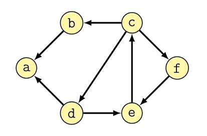
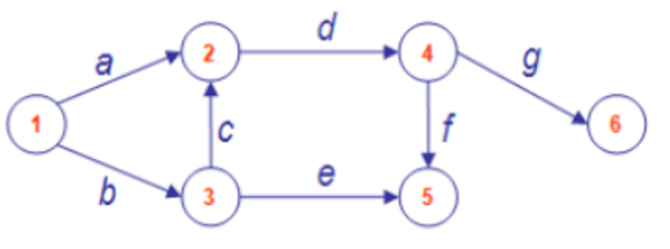
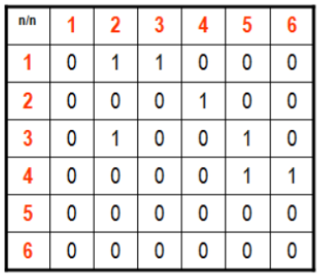
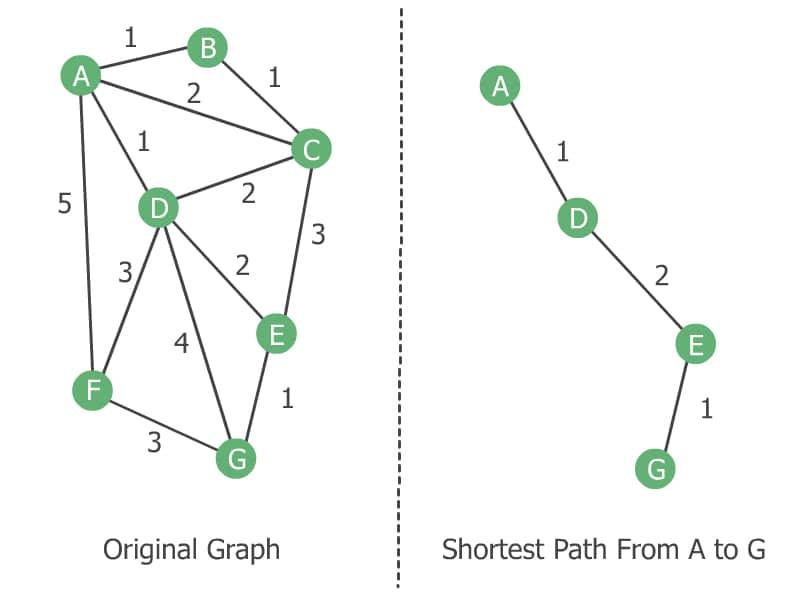
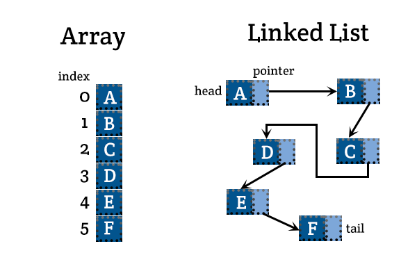
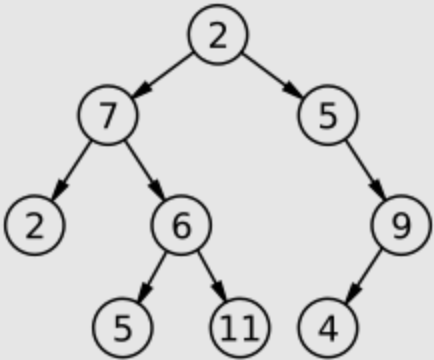
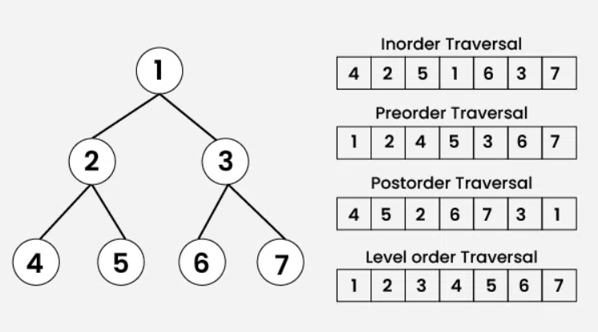
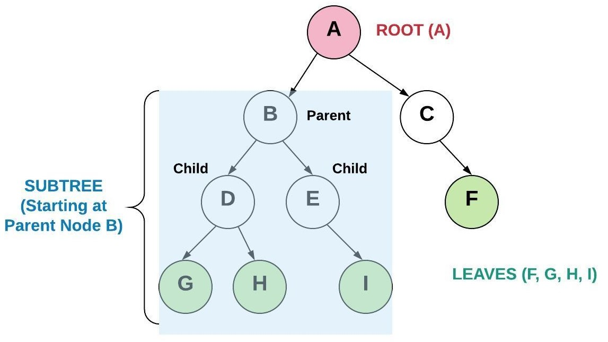
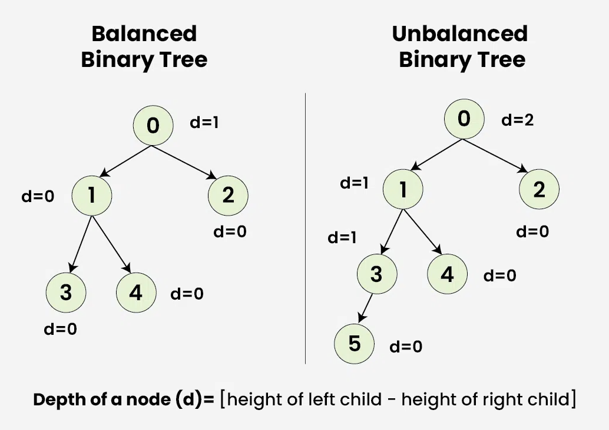
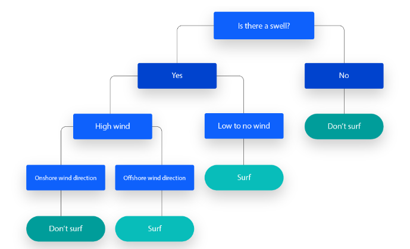

# Introduzione alle strutture dati ricorsive
di Federico Dutto - studente di Ingegneria Informatica presso il Politecnico di Torino

***

### Capitoli

1. [Introduzione](#1-introduzione)
2. [Basi di teoria dei grafi](#2-basi-di-teoria-dei-grafi)
3. [Implementazione lista semplice](#3-implementazione-lista-semplice)
4. [Teoria degli alberi binari](#4-teoria-degli-alberi-binari)
5. [Implementazione alberi binari](#5-implementazione-alberi-binari)
6. [Alberi binari come alberi decisionali](#6-alberi-binari-come-alberi-decisionali)

***

## 1. Introduzione

Questa guida si prefigge lo scopo di approcciare lo studio delle strutture dati ricorsive elementari, derivate dalla teoria dei grafi, nel linguaggio C. Si presuppone di conseguenza la conoscenza dei costrutti e degli algoritmi elementari di questo linguaggio, in particolare di ```struct```, delle tecniche di gestione della memoria e di cenni di algebra dei puntatori, nonché di basilari conoscenze matematiche.

In caso queste competenze in programmazione non siano soddisfatte, è possibile consultare il manuale ufficiale di GNU a questo [link](https://www.gnu.org/software/gnu-c-manual/gnu-c-manual.html). Ogni competenza qui presentata dall'autore è derivata dal corso di "Tecnologie e Progettazione di Sistemi Informatici e Telecomunicazioni" (TPSIT) dell'indirizzo "Informatica e telecomunicazioni" presso l'ITIS Delpozzo di Cuneo.

***

## 2. Basi di teoria dei grafi

I grafi, per definizione, sono delle strutture matematiche che permettono di schematizzare situazioni, per consentirne analisi e/o algoritmi. Vengono rappresentati tramite degli elementi chiamati "nodi", connessi tra loro da linee chiamate "archi".

<p align="center">

</p>

I grafi, a livello di struttura e nomenclatura, posseggono le seguenti caratteristiche:

- Gli archi posso essere *orientati*, ovvero possedere una freccia. In caso contario, si parlerà di grafo *non-orientato*;
- Il valore espresso di ciascun nodo prende il nome di *chiave* (key);
- Un grafo si dice *connesso* quando tutti i nodi sono collegati tra di loro da archi. Altrimenti, prenderà il nome di *non connesso*;
- Un *cappio* è un arco che parte e ritorna sullo stesso nodo;
- Si parla di grafo *ciclico* quando partendo da un nodo e seguendo la direzione degli archi, è possibile ritornare al nodo di partenza;
- Anche gli archi possono possedere dei valori: avremo quindi un arco definito come *pesato*.

Le strutture dati trattate in questa guida quindi sono dei grafi con proprie peculiarità, utili per risolvere problemi di diverso tipo. A livello di programmazione, si definiscono strutture dati *ricorsive* in quanto visitabili e alterabili grazie ad algoritmi in cui la funzione viene richiamata all'interno della funzione stessa.

```c
//esempio di algoritmo ricorsivo (comparazione tra due stringhe)
int cmpStr(char* s1, char* s2) {

    if(*s1 > *s2) return -1;    
    if(*s1 < *s2) return 1;
    if(*s1 == '\0') return 0;   
    return cmpStr(++s1, ++s2);
}
```

Nel nostro caso non tratteremo i dettagli dell'implementazione di un grafo, il quale può essere ad esempio visualizzato tramite la cosiddetta "matrice delle adiacenze", contentente un valore alla posizione riga-colonna dei nodi connessi da un arco.

<p align="center">


</p>

Una tipica applicazione dei grafi può essere individuata negli algoritmi per la ricerca del cammino minimo. Infatti, basandoci su un grafo pesato, è possibile individuare il percorso con il minor "costo" (somma dei pesi degli archi) per raggiungere un nodo partendo da un altro nodo. L'algoritmo più conosciuto in questo senso è quello di [Dijkstra](https://www.geeksforgeeks.org/dijkstras-shortest-path-algorithm-greedy-algo-7/), il quale viene ad oggi utilizzato per individuare nelle reti informatiche il percorso più veloce per raggiungere un determinato router.

<p align="center">

</p>


***

## 3. Implementazione lista semplice

### 3.1. Definizione e differenze con i vettori

Una lista, in termini informatici, viene utilizzata per contere una collezione di dati. Per definizione, infatti, è una "*struttura dati di tipo omogeneo allocata in memoria in modo non contiguo*". Questa proposizione può essere associata facilmente alla definizione di **vettore**, la cui caratteristica però è di essere allocata in modo contiguo. Questo significa infatti che per un vettore i dati risiedono in zone di memoria tra loro adiacenti, mentre per le liste questa caratteristica non è rilevante.

<p align="center">

</p>


Altro concetto fondamentale, ben visualizzabile dell'immagine presentata qui sopra, è la composizione della struttura dati: mentre un vettore è un puntatore alla prima cella di una collezione di dati tra loro vicini in memoria, una lista è una serie di ```struct```, ciascuno composto da:

- una chiave, che rappresenza il valore contenuto;
- il puntatore al nodo successivo.

Seguendo la teoria dei grafi, la lista quindi è un grafo connesso i cui nodi posseggono un singolo arco orientato verso il nodo successivo. 

Questa caratteristica porta la struttura dati a seguire la politica LIFO (Last In, First Out), in cui l'ultimo elemento inserito sarà il primo ad essere visitato, al contrario del vettore che segue la politica FIFO (First In, First Out), ovvero il primo elemento inserito sarà il primo ad essere visitato. Si applicherà quindi per la lista il concetto di "*pila*", in cui gli elementi verranno quindi aggiunti ogni volta in testa alla collezione. In termini di applicazioni, questo è il motivo principale per cui in certe situazioni si preferisce utilizzare liste a vettori.

***

### 3.2. Implementazione di base

Seguendo la teoria, lo ```struct``` di ogni nodo sarà così definito:
```c
struct Node {
    int key;
    struct Node* next;
};
```
- ```key```, ovvero la chiave, rappresenza il valore contenuto;
- ```next``` è il puntatore al nodo successivo.

***

### 3.3. Aggiunta di un nodo (push)

Per aggiungere elementi alla lista, nel ```main()``` vorremmo scrivere un'espressione del tipo:
```c
struct Node* list = null;
list = push(5, list);
```
La funzione ```push()``` infatti aggiunge in testa alla lista un nuovo elemento. Per farlo, dovremo avvalerci delle seguenti funzioni:

```c
struct Node* push(int key, struct Node* node) {

    return createNode(key, node);
}

struct Node* createNode(int key, struct Node* node) {

    struct Node* ret = (struct Node*) malloc(sizeof(struct Node));
    ret->key = key;
    ret->next = node;
    return ret;
}
```
In cui push è un *wrapper* di createNode, per buona norma di programmazione. Il valore di ritorno sarà di conseguenza il puntatore al primo elemento, ovvero quello appena inserito.

***

### 3.4. Rimozione di un nodo (pop)

Al contrario, la funzione per eliminare il nodo in testa prende il nome di ```pop()```. Notare come viene gestita l'eliminazione dell'istanza a seguito di ```malloc()```, in modo da evitare qualsiasi *[memory leak](https://www.geeksforgeeks.org/what-is-memory-leak-how-can-we-avoid/)*.

```c
struct Node* pop(int* key, struct Node* node) {

    *key = node->key;
    struct Node* ret = node->next;
    free(node);
    return ret;
}
```
Il valore di ritorno sarà quindi il primo elemento della lista, ovvero il nodo inserito prima di quello appena eliminato.

***

### 3.5. Visita della lista (show)

Il vantaggio di implementare strutture dati ricorsive risiede infatti nella semplicità di visita e alterazione delle suddette proprio grazie ad algoritmi di tipo ricorsivo. Ne è un esempio la funzione ```show()```, per mostrare a video l'intera lista.

```c
void show(struct Node* first) {
    
    if(first) {

        show(first->next);
        printf("%d", first->key);  
    }
}
```

***

### 3.6. Ulteriori funzioni utili (clean & isEmpty)

Al programmatore potranno risultare utili inoltre le seguenti funzioni:

- ```clean()``` per eliminare ogni istanza dei nodi, in modo da evitare *[memory leak](https://www.geeksforgeeks.org/what-is-memory-leak-how-can-we-avoid/)*;
- ```isEmpty()``` per verificare che l'istanza della lista sia completamente vuota.

```c
struct Node* clean(struct Node* first) {

    while(!isEmpty(first))
        pop(NULL, first);
}

int isEmpty(struct Node* first) {

    if(!first) return 0;
    else return 1;
}
```

***

### 3.7. Esempio di codice

Al lettore viene proposto il codice del seguente problema, il quale sfrutta l'implementazione delle funzioni sopra citate:

*"Data una lista di interi presa in input dall'utente, stampare a video la somma dei valori."*

```c
int main(int argc, char** argv) {

    if(argc < 2) {

        printf("Usage: %s #VALUE1 #VALUE2...", *argv);
        return -1;
    }

    struct Node* first = NULL;
    for(argv++; *argv; argv++) first = push(atoi(*argv), first);

    show(first);

    int total = 0;
    sum(first, &total);
    printf("\nSum of all the keys: %d", total);

    clean(first);

    return 0;
}

void sum(struct Node* first, int* total) {
    
    if(first) {

        *total = *total + first->key;  
        sum(first->next, total);
    }
}
```

***

## 4. Teoria degli alberi binari

### 4.1. Definizione e struttura

Un albero binario è un grafo la cui caratteristica principale è un massimo di 2 archi orientati uscenti per ciasun nodo, e massimo un arco in entrata. È un grafo aciclico e connesso. Questo tipo di struttura ricorsiva è l'argomento centrale in questa guida, in quanto comporta applicazioni pratiche fuori dall'ordinario per un principiante, come il machine learning.

<p align="center">

</p>

Osservando al meglio l'immagine, possiamo individuare dei nodi caratteristici:

- Il nodo di partenza prende il nome di "*root*" (radice). Questo è l'unico nodo senza alcun arco entrante;
- I nodi al fondo dell'albero, ovvero quelli che non posseggono alcun arco in uscita, prendono il nome di "*leaves*" (foglie).

Per ciascun nodo, il nodo superiore con il riferimento al nodo in questione verrà chiamato nodo "*padre*" o "*genitore*" ("*parent*"), mentre i nodi in uscita prenderanno il nome di "*figlio*"/"*figli*" ("*child*"/"*children*"), a seconda se siano due o soltanto uno.

A livello di struttura, ogni nodo sarà analogo a quelli di una lista, con la differenza di possedere un puntatore in più:

- una chiave, che rappresenza il valore contenuto;
- il puntatore al nodo di destra;
- il puntatore al nodo di sinistra.

***

### 4.2. Tipologie di visite

A meno di strumenti grafici particolari, per visualizzare (o più in generale visitare) in modo sequenziale i nodi di un albero binario, avremo 4 diversi tipi di letture:

- Differita (pre-order): viene letto prima il nodo a sinistra, poi quello a destra e infine il parent;
- Anticipata (post-order): viene letto prima il padre e poi i figli;
- Simmetrica (in-order): viene letto prima il nodo a sinistra, poi il padre e infine quello a destra;
- Per livello (level-order): viene letto l'albero livello per livello, partendo dalla cima.

<p align="center">

</p>

Nella capitolo successivo della guida saranno presenti le funzioni ricorsive per implementare queste visite. Unica eccezione viene fatta per la level-order, che comparirà solamente nel capitolo finale come curiosità.

***

### 4.3. Sottoalberi e bilanciamento

A seconda dell'utilizzo, partendo da un nodo sarà possibile estrapolare un sotto-albero (subtree). Per visualizzarne uno, basterà passare alla funzione di visualizzazione il nodo di partenza del sotto-albero che vogliamo individuare.

<p align="center">

</p>

Inoltre, esistono algoritmi per "*bilanciare*" un albero binario: quando la struttura possiede un numero elevato di nodi, può sovente accadere che siano in numero maggiore a destra della radice rispetto alla sinistra o viceversa. Per capire se un albero è sbilanciato, si deve far riferimento all'altezza dell'albero tra destra e sinistra, per calcolare la profondità come nell'immagine:

<p align="center">

</p>

***

## 5. Implementazione alberi binari

L'albero che costruiremo sfrutterà il criterio per cui se il valore numerico che vogliamo aggiungere è maggiore o uguale al valore della chiave, verrà aggiunto al sottonodo di destra, altrimenti a quello di sinistra. Questa caratteristica porterà alla stampa dei numeri in ordine crescente ogni volta che faremo una lettura simmetrica (in-order).

### 5.1. Struttura del nodo

Seguendo la teoria, lo ```struct``` di ogni nodo sarà così definito:
```c
struct Binary_tree {
    struct Binary_tree* left;
    int key;
    struct Binary_tree* right;
};
```
- ```left``` è il puntatore al nodo di sinistra;
- ```key```, ovvero la chiave, rappresenza il valore contenuto;
- ```right``` è il puntatore al nodo di destra.

***

### 5.1. Dichiarazione e aggiunta di elementi (add)

Il codice per creare un nuovo albero binario e aggiungerne valori sarà semplicemente (nel ```main()```):

```c
struct Binary_tree* root = newBinaryTree();

root = add(root, 8);
root = add(root, 32);
root = add(root, 6);

cleanBinaryTree(root);
```
In cui ```newBinaryTree()``` è semplicemente una funzione per migliorare la leggibilità del codice:

```c
struct Binary_tree* newBinaryTree() {
    return NULL;
}
```

Mentre la funzione fondamentale in tutta la guida risulta la seguente:

```c
struct Binary_tree* add(struct Binary_tree* root, int key) {  
    
    //creazione e inizializzazione nuova foglia
    struct Binary_tree* current = (struct Binary_tree*) malloc(sizeof(struct Binary_tree));
    
    current->key = key;
    current->left = NULL;
    current->right = NULL;

    //ritorna il nodo se la struttura di partenza è NULL
    if(!root) return current;

    //aggiunge a sinitra, richiamando ricorsivamente la funzione 
    if(root->key > key) root->left = add(root->left, key);    
    //aggiunge a destra, richiamando ricorsivamente la funzione 
    else root->right = add(root->right, key); 

    //ritorna il puntatore alla struttura aggiornata
    return root;
}
```

Infatti per aggiungere una nuova foglia, la funzione svolge il seguenti passi:

- Istanzia e inizializza la foglia che si vuole aggiungere;
- Se ricorsivamente si è arrivati alla foglia vuota (oppure l'albero risulta vuoto), il nodo creato diventa quell'elemento;
- Viene richiamata ricorsivamente la funzione, passando il puntatore destro e sinistro a seconda se la chiave inserita è maggiore o minore di quella del nodo corrente, solamente quando non si è arrivati ancora alla posizione corretta per la foglia da inserire;
- Ritorna il puntatore alla struttura aggiornata.

Anche in questo caso, al termine del programma sarà necessario de-allocare la struttura:

```c
struct Binary_tree* cleanBinaryTree(struct Binary_tree* root) {

    if(root) {

        cleanBinaryTree(root->left);
        cleanBinaryTree(root->right);
        free(root);
    }
    return NULL;
}
```

***

### 5.3. Tipologie di letture (show)

Qui in seguito vengono proposte le funzioni per i differenti tipi di letture. È importante notare come queste ultime siano la stessa funzione chiamata 2 volte ricorsivamente (una per il nodo child di sinistra e una per quello di destra) oltre alla stampa della chiave, in cui viene combinato l'ordine delle operazioni.

- Differita (post-order):
```c
void showPostOrder(struct Binary_tree* root) {

    if(root) { 
        
        showPostOrder(root->left);
        showPostOrder(root->right);
        printf("%5d", root->key);
    }
}
```

- Anticipata (pre-order):
```c
void showPreOrder(struct Binary_tree* root) {

    if(root) { 
        
        printf("%5d", root->key);
        showPreOrder(root->left);
        showPreOrder(root->right);
    }
}
```

- Simmetrica (in-order):
```c
void showInOrder(struct Binary_tree* root) {

    if(root) { 
        
        showInOrder(root->left);
        printf("%5d", root->key);
        showInOrder(root->right);
    }
}
```

***

## 6. Alberi binari come alberi decisionali

### 6.1. Generalità

Una delle applicazioni più comuni degli alberi binari riguarda l'utilizzo come albero decisionale. Quest'ultimo consiste nel concatenare regole decisonali come nell'esempio sottostante:

<p align="center">

</p>

Questo impiego è comune nel machine-learning, in cui queste strutture fungono da modelli predittivi, nelle quali ogni arco verso un nodo figlio rappresenta un possibile valore per quella proprietà. Per costruire questo tipo di alberi saranno necessari quindi un buon quantitativo di dati iniziali, chiamati *data set*.

Lo studio di questo tipo di costrutti non è sicuramente obiettivo della guida, in quanto argomenti più di alto livello, ma nei paragrafi successivi viene illustrata una semplice soluzione.

***

### 6.2. Il problema di "Akinator"

Uno dei più comuni siti online risulta essere il celebre "Akinator", in cui un algoritmo, a seguito di una serie di domande rivolte all'utente, indovina il nome di un personaggio pubblico da lui scelto. Noi vogliamo prefiggerci uno scopo simile, in cui l'algoritmo però dovrà indovinare un animale da noi pensato.

In corrispondenza delle foglie avremo quindi i nostri animali, mentre negli altri nodi interni il campo ```text``` conterrà la domanda per indirizzare l'utente a destra o sinistra.

Essendo una struttura decisionale, ```left``` e ```right``` nello ```struct``` verranno rinominati in ```yes``` e ```no```, mentre la chiave sarà una stringa:

```c
typedef struct AnimalNode {

	char* text;	
	struct AnimalNode* yes;
	struct AnimalNode* no;
};
```

Per prendere in input i dati runtime, sfrutteremo la seguente funzione:

```c
#define MAX_STR 1024

char* inputStr() {
	
	char buffer[MAX_STR];
	int i = 0;
	for(; (*(buffer + i) = getchar())!= '\n'; i++) { }
	*(buffer + i) = '\0';
	return strdup(buffer);
}
```

### 6.3. Algoritmo principale

L'algoritmo continuerà a funzionare fino a quando decide l'utente, per cui il corpo principale sarà:

```c
struct AnimalNode* tree = createAnimalNode("Cane", NULL, NULL);
struct AnimalNode* curr = tree;

int game = 1;

while(game == 1) {

	if(isLeaf(curr)) {

		if(askYesNo(curr->text)) printf("Ho vinto!");
		else {
			printf("Non ho indovinato!");
			curr = createNewAnimal(curr);
		}
		curr = tree;
			
		printf("\nContinuare a giocare? (s/n) ");
		char* ans = inputStr();
		if(strcmp(ans, "n") == 0) game = 0;
		free(ans);
	}
	else {

		if(askYesNo(curr->text)) curr = curr->yes;
		else curr = curr->no;
	}
}
```

In questo primo frammento di codice possiamo osservare:

- Se non si è arrivati alla foglia, l'algoritmo segue le risposte dell'utente navigando per l'albero fino al raggiungimento di una foglia (ovvero il possibile animale finale);

- Se si è arrivati alla foglia, l'algoritmo chiede se ha indovinato. In caso positivo, il programma afferma di aver vinto, altrimenti esegue la funzione createNewAnimal(), la cui implementazione è visibile qui sotto.

```c
struct AnimalNode* createNewAnimal(struct AnimalNode* curr) { 

	char* text = inputStrPrompt("Che animale era?\n");
	printf("Inserisci una domanda per distinguere un %s da un %s (in caso di risposta positiva sara' un %s): ", 
		curr->text, text, text);
	char* question = inputStr();
	
	struct AnimalNode** old = createAnimalNode(text, NULL, NULL);
	struct AnimalNode** new = createAnimalNode(curr->text, NULL, NULL);	
	setAnimal(curr, question, old, new);

	free(text);
	free(question);
	
	return curr;	
}

void setAnimal(struct AnimalNode** curr, char* text, struct AnimalNode** yes, struct AnimalNode** no) {
	
	free(curr->text);
	curr->text = strdup(text);
	curr->yes = yes;
	curr->no = no;
}
```

```createNewAnimal()```, insieme alla funzione ```setAnimal()```, si occuperanno di alterare la struttura: verrà aggiunto un nuovo nodo contenente come ```text``` la domanda per differenziare l'animale dell'utente da quello proposto dal programma, visto che non è stato indovinato. Come foglie di questo nuovo nodo che ha preso il posto di quello dell'animale presentato dall'algoritmo avremo:

- L'animale aggiunto dall'utente nel campo ```yes```;
- L'animale proposto dall'albero nel campo ```no```.

Per completezza, vengono presentate le anche funzioni ```askYesNo()```, ```createAnimalNode()``` e ```isLeaf()```

```c
int askYesNo(char* prompt) {

	printf("%s? (s/n): ", prompt);
	char* ans;
	while((strcmp(ans = inputStr(), "s")) != 0 && (strcmp(ans, "n") != 0));
	return (strcmp(ans, "s") == 0);
}

struct AnimalNode* createAnimalNode(char* text, int id, struct AnimalNode* yes, struct AnimalNode* no) {

	struct AnimalNode* ret = (struct AnimalNode*) malloc(sizeof(struct AnimalNode));
	ret->text = strdup(text);
	ret->yes = yes;		
	ret->no = no;
	return ret;
}

int	isLeaf(struct AnimalNode* node) {

    return ((node->yes == NULL) && (node->no == NULL));
}
```

### 6.4. Persistenza e dettagli

In conclusione, quando ci ritroviamo davanti ad algoritmi di questo tipo che necessitano di diverse esecuzioni per aumentare i dati a loro diposizione, risulta comodo rendere persistenti le informazioni presenti nella struttura. Per farlo, è stata realizzata una miglioria all'algoritmo in cui l'intero contenuto dell'albero viene salvato su un file ```.txt```, una volta terminata l'esecuzione.

Su questo documento infatti i dati si presentano disposti secondo una lettura level-order: suddividendo l'albero in livelli, verranno scritti nel file per prima gli elementi del livello più alto fino a quello più basso. Questo ci permette, una volta che il programma viene eseguito, di poter inserire i nodi in maniera sequenziale rispettando la struttura iniziale.

<p align="center">

</p>

Al seguente [link](https://github.com/fededmagic/animals) è possibile visualizzare il codice completo per la realizzazione della persistenza dell'albero decisionale.
